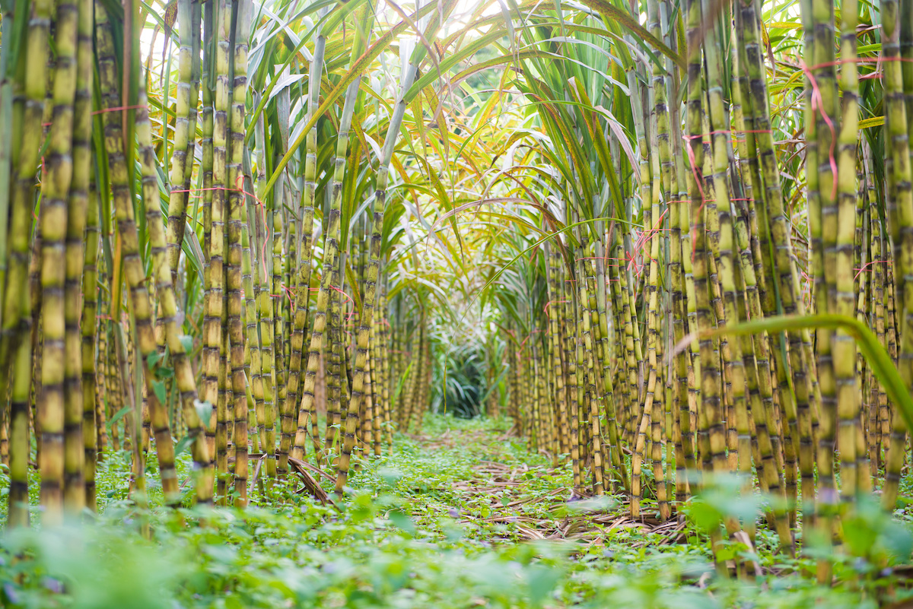

# SmartCane - Sugarcane Yield Prediction Web Application



## Overview

**SmartCane** is an AI-powered web application designed to help farmers and agribusinesses accurately predict sugarcane yield based on farm-specific conditions. By leveraging machine learning and data analytics, SmartCane empowers users to make informed decisions about their sugarcane cultivation and optimize farming practices.

## 🎯 Mission

Our mission is to empower farmers and agribusinesses by leveraging cutting-edge technology to enhance sugarcane cultivation. By providing accurate yield predictions and actionable insights, we aim to help farmers maximize productivity and profitability while optimizing resource utilization.

## ✨ Key Features

### 🎯 Accurate Predictions
- Advanced Random Forest machine learning model provides reliable yield forecasts
- Based on comprehensive farm-specific conditions and environmental factors
- Trained on extensive agricultural data from South Asian regions

### 🌱 Optimized Farming
- Get actionable insights to improve sugarcane cultivation practices
- Data-driven recommendations for resource optimization
- Maximize yield through informed decision-making

### 🌍 Regional Focus
- Specially designed for South Asian farmers
- Considers local climate conditions, soil types, and agricultural practices
- Supports multiple countries: India, Bangladesh, Nepal, Pakistan, and Sri Lanka

### 🖥️ User-Friendly Interface
- Clean, intuitive web-based interface
- Responsive design works on desktop, tablet, and mobile devices
- Easy-to-use form for inputting farm parameters
- Instant prediction results with visual feedback

## 📋 Input Parameters

The prediction model considers the following farm parameters:

| Parameter | Type | Description | Example |
|-----------|------|-------------|---------|
| **Area** | Numerical | Farm area in hectares | 5.5 |
| **Rainfall** | Numerical | Average annual rainfall in mm | 1500 |
| **Contract Area** | Numerical | Contracted cultivation area in hectares | 5.0 |
| **Fertilizer Type** | Categorical | Type of fertilizer used | Organic / Chemical |
| **Epidemic Control** | Categorical | Pest/disease control method | Preemergent / Herbicide |
| **Water Type** | Categorical | Primary water source | Rain / Natural Canal / Ground Water |
| **Soil Type** | Categorical | Soil classification | Silty Clay / Loam / Ferus Soil |
| **Fertilizer Composition** | Categorical | NPK ratio of fertilizer | 16-16-16 / 15-15-15 / 46-0-0 / 7-25-7 |
| **Country** | Categorical | Geographic location | India / Bangladesh / Nepal / Pakistan / Sri Lanka |

## 🚀 Getting Started

### Prerequisites

- Python 3.7+
- Flask
- pandas
- numpy
- scikit-learn
- joblib

### Installation

1. **Clone the repository:**
   ```bash
   git clone https://github.com/DulakshiGuruge2001/smartcane-webapp.git
   cd smartcane-webapp
   ```

2. **Install required dependencies:**
   ```bash
   pip install flask pandas numpy scikit-learn joblib
   ```

3. **Run the Flask application:**
   ```bash
   python app.py
   ```

4. **Open your browser:**
   Navigate to `http://localhost:5000` to access the application

## 🏗️ Project Structure

```
smartcane-webapp/
├── app.py                          # Flask backend application
├── index.html                      # Web interface (HTML/CSS/JavaScript)
├── rf_classifier_model.pkl         # Trained Random Forest model
├── scaler.pkl                      # Feature scaler for numerical data
├── encoder.pkl                     # Categorical encoder for feature encoding
├── selected_features.pkl           # Selected feature list for model input
├── Dulakshi.jpg                    # Team member photo
├── Shenooy.jpg                     # Team member photo
├── Dihan.jpg                       # Team member photo
├── sugercane.jpg                   # Marketing imagery
├── Webapp.pdf                      # Documentation/specifications
└── README.md                       # This file
```

## 🔧 Technical Architecture

### Backend (Flask - Python)

The Flask application handles:
- **Model Loading**: Loads the pre-trained Random Forest classifier and preprocessing objects
- **Data Preprocessing**:
  - Categorical encoding using LabelEncoder
  - Numerical feature scaling using StandardScaler
  - Feature selection based on trained model requirements
- **Prediction API**: POST endpoint `/predict` that accepts farm parameters and returns yield predictions
- **Static File Serving**: Serves the HTML interface and required assets

### Frontend (HTML/CSS/JavaScript)

The web interface includes:
- **Responsive Navigation**: Easy navigation between different sections
- **Hero Section**: Eye-catching introduction with call-to-action
- **Prediction Form**: Comprehensive form for inputting farm parameters
- **Result Display**: Clear visual feedback for prediction results
- **About Section**: Team information and mission statement
- **Contact Section**: Communication channels and social media links
- **Bootstrap 5**: For responsive grid layout and styling
- **Font Awesome**: Icons for enhanced visual appeal

### Machine Learning Model

- **Algorithm**: Random Forest Classifier
- **Target Variable**: Yield classification (High / Low)
- **Input Features**: 9 features (5 numerical + 4 categorical)
- **Preprocessing Pipeline**:
  1. Categorical feature encoding
  2. Numerical feature scaling
  3. Feature selection
  4. Model prediction

## 📡 API Endpoint

### POST `/predict`

**Request Format:**
```json
{
  "Area": 5.5,
  "Rainfall": 1500,
  "Contract_Area": 5.0,
  "Fertilizer_Type": "Organic",
  "Epidemic": "Preemergent",
  "Water_Type": "Natural Canal",
  "Soil_Type": "Loam",
  "Fertilizer": "16-16-16",
  "Country": "India"
}
```

**Response Format (Success):**
```json
{
  "prediction": "High",
  "status": "success"
}
```

**Response Format (Error):**
```json
{
  "error": "Error message details",
  "status": "error"
}
```

## 🎨 User Interface Features

### Navigation
- **Home**: Introduction and feature highlights
- **Predict Now**: Interactive form for yield prediction
- **About Us**: Team information and mission statement
- **Contact**: Communication details and social media links

### Design Highlights
- **Color Scheme**: Green palette (primary: #2e7d32, secondary: #81c784, accent: #ff8f00)
- **Typography**: Modern sans-serif fonts for readability
- **Responsiveness**: Mobile-first design that adapts to all screen sizes
- **User Feedback**: Loading states, visual result indicators, and smooth scrolling

## 👥 Team Members

| Name | Qualification |
|------|---------------|
| **Dulakshi Guruge** | BSc Hons. Statistics (Undergraduate) |
| **Shenooy Fernando** | BSc Hons. Statistics (Undergraduate) |
| **Dihan Ariyarathne** | BSc Hons. Data Science (Undergraduate) |

## 📞 Contact Information

- **Email**: info@smartcane.com
- **Phone**: +94 112 345 678
- **Address**: 123, Agritech Avenue, Colombo, Sri Lanka

### Follow Us
- [Facebook](https://facebook.com/smartcane)
- [Twitter](https://twitter.com/smartcane)
- [Instagram](https://instagram.com/smartcane)
- [LinkedIn](https://linkedin.com/company/smartcane)

## 🔐 Security Considerations

- Always validate user input on both frontend and backend
- Consider implementing CSRF protection for production deployment
- Use environment variables for sensitive configuration
- Implement rate limiting for the `/predict` endpoint to prevent abuse
- Consider adding authentication for future multi-user features

## 📦 Dependencies

```
Flask==2.x.x
pandas>=1.x.x
numpy>=1.x.x
scikit-learn>=0.x.x
joblib>=1.x.x
```

Install all dependencies:
```bash
pip install -r requirements.txt
```

## 🚀 Deployment

### Local Development
```bash
python app.py
```
Access at: `http://localhost:5000`

### Production Deployment
For production, consider:
1. Using a production WSGI server (Gunicorn, uWSGI)
2. Disabling Flask debug mode (`debug=False`)
3. Using environment variables for configuration
4. Implementing proper logging and error handling
5. Setting up SSL/TLS for HTTPS

## 📊 Model Performance

The Random Forest model was trained on historical sugarcane yield data from South Asian regions, considering:
- Geographic and climatic factors
- Soil characteristics
- Agricultural practices
- Water management systems
- Fertilizer application methods

## 🎓 Educational Value

This project demonstrates:
- Machine Learning implementation in web applications
- Full-stack web development (Frontend + Backend)
- Data preprocessing and feature engineering
- RESTful API design
- Responsive web design principles
- Integration of ML models with web frameworks

## 📝 License

This project is open source and available for educational and commercial use. Please provide appropriate attribution to the SmartCane team.

## 🤝 Contributing

We welcome contributions! To contribute:
1. Fork the repository
2. Create a feature branch (`git checkout -b feature/AmazingFeature`)
3. Commit changes (`git commit -m 'Add AmazingFeature'`)
4. Push to the branch (`git push origin feature/AmazingFeature`)
5. Open a Pull Request

## 🐛 Bug Reports & Feature Requests

Found a bug or have a feature idea? Please open an issue on GitHub with:
- Clear description of the issue
- Steps to reproduce (for bugs)
- Expected vs. actual behavior
- Screenshots if applicable

## 📚 Future Enhancements

- [ ] User authentication and account management
- [ ] Historical data storage and analytics dashboard
- [ ] Mobile native applications (iOS/Android)
- [ ] Integration with weather APIs for real-time data
- [ ] Multi-language support
- [ ] Advanced analytics and reporting features
- [ ] Recommendations for crop management
- [ ] Support for other crop types

## 🙏 Acknowledgments

- Developed by the SmartCane Team
- Special thanks to the agricultural research community
- Built with Flask, Bootstrap 5, and scikit-learn
- Dedicated to supporting farmers in South Asia

## 📄 Additional Documentation

Refer to `Webapp.pdf` for detailed technical specifications and project documentation.

---

**Made with ❤️ by the SmartCane Team**

*Empowering farmers with AI-driven sugarcane yield predictions.*
